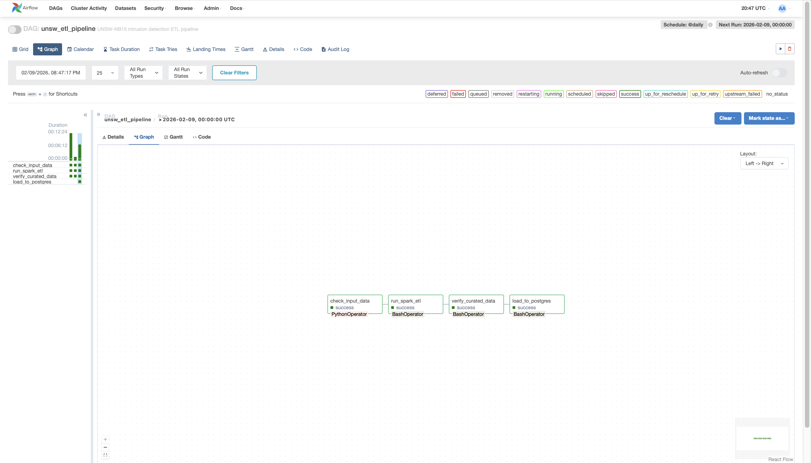
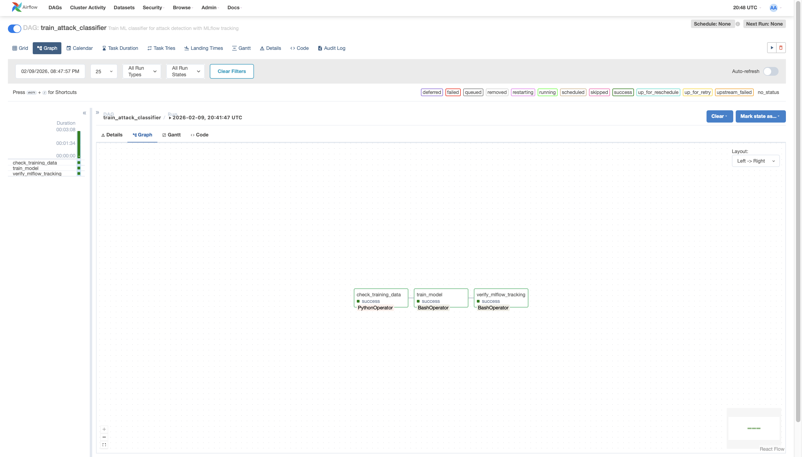
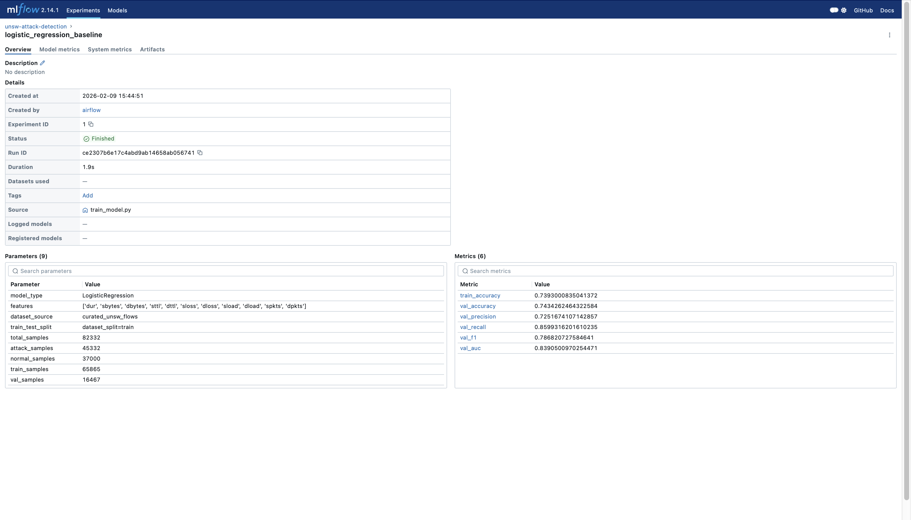
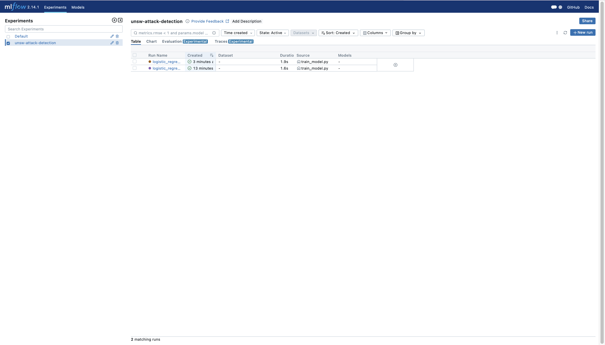

# Risk Intelligence Platform
## ML-Powered Security Threat Detection & Analytics

[](https://airflow.apache.org/)
[](https://mlflow.org/)
[](https://spark.apache.org/)
[](https://www.postgresql.org/)
[](https://www.docker.com/)

---

## Overview

An **end-to-end machine learning platform** for security threat intelligence, processing 257,000+ network security events through orchestrated data pipelines with experiment tracking and analytics capabilities.

**Key Capabilities:**
- Automated ETL pipelines with Apache Airflow
- Distributed processing with PySpark
- SQL-queryable analytics warehouse (PostgreSQL)
- ML model training with MLflow experiment tracking
- Attack detection classifier (84% AUC, 79% F1)

**Dataset:** [UNSW-NB15](https://research.unsw.edu.au/projects/unsw-nb15-dataset) - Modern network intrusion detection dataset with 9 attack categories

---

## 🏗️ Architecture

```
Raw CSV Data → Spark ETL → Parquet Storage → Postgres Warehouse → ML Training → MLflow Tracking
      ↓              ↓            ↓                ↓                   ↓              ↓
  Validation    Transforms   Partitioned      SQL Analytics      Classification   Experiments
```

**Full architecture diagram:** [See docs/architecture.md](docs/architecture.md)

### Tech Stack

| Component | Technology | Purpose |
|-----------|-----------|---------|
| **Orchestration** | Apache Airflow | DAG scheduling, monitoring, retries |
| **Processing** | PySpark | ETL transformations at scale |
| **Storage** | Parquet + PostgreSQL | Columnar files + relational warehouse |
| **ML Tracking** | MLflow | Experiment logging & comparison |
| **Infrastructure** | Docker Compose | Containerized local deployment |

---

## Quick Start

### Prerequisites
- Docker Desktop (Mac/Windows) or Docker Engine (Linux)
- Docker Compose v2.x
- 8GB+ RAM, 10GB+ disk space

### Setup

```bash
# 1. Clone repository
git clone https://github.com/YOUR_USERNAME/risk-intel-platform.git
cd risk-intel-platform

# 2. Download UNSW-NB15 dataset
# Place files in data/local/raw/unsw_nb15/:
#   - UNSW_NB15_training-set.csv
#   - UNSW_NB15_testing-set.csv
# Download: https://research.unsw.edu.au/projects/unsw-nb15-dataset

# 3. Start services
docker compose up -d

# 4. Install ML dependencies (temporary - see Known Issues)
docker exec -it $(docker ps -q -f name=airflow-webserver) \
  pip install scikit-learn mlflow psycopg2-binary
docker exec -it $(docker ps -q -f name=airflow-scheduler) \
  pip install scikit-learn mlflow psycopg2-binary

# 5. Access UIs
# Airflow: http://localhost:8080 (airflow/airflow)
# MLflow:  http://localhost:5001
```

---

## Results

### Model Performance

| Metric | Value |
|--------|-------|
| **Accuracy** | 74.2% |
| **Precision** | 72.4% |
| **Recall** | 85.9% |
| **F1 Score** | 78.6% |
| **AUC-ROC** | 83.8% |

### Dataset Statistics

| Split | Normal | Attack | Total |
|-------|--------|--------|-------|
| **Train** | 37,000 | 45,332 | 82,332 |
| **Test** | 56,000 | 119,341 | 175,341 |

### Top Attack Types

| Attack Category | Count | % of Attacks |
|----------------|-------|--------------|
| Generic | 58,871 | 35.8% |
| Exploits | 44,525 | 27.1% |
| Fuzzers | 24,246 | 14.7% |
| DoS | 16,353 | 9.9% |
| Reconnaissance | 13,987 | 8.5% |

---

## Usage

### Running Pipelines

**Data Pipeline:**
1. Open Airflow: http://localhost:8080
2. Enable `unsw_etl_pipeline`
3. Trigger manually or let run on schedule

**ML Training:**
1. After data pipeline succeeds
2. Trigger `train_attack_classifier`
3. View results in MLflow: http://localhost:5001

### Querying Data

```bash
# Connect to Postgres
docker exec -it $(docker ps -q -f name=postgres) psql -U airflow -d warehouse

# Example queries
SELECT COUNT(*) FROM curated_unsw_flows;

SELECT attack_cat, COUNT(*) as total
FROM curated_unsw_flows 
WHERE label = 1
GROUP BY attack_cat
ORDER BY total DESC;
```

---

## Project Structure

```
risk-intel-platform/
├── airflow/
│   ├── dags/
│   │   ├── unsw_etl_pipeline.py          # Data ETL DAG
│   │   ├── train_attack_classifier.py     # ML training DAG
│   │   └── hello_risk_intel_dag.py       # Demo DAG
│   ├── spark_jobs/
│   │   ├── etl_unsw_to_curated.py        # PySpark ETL
│   │   ├── load_to_postgres.py            # Postgres loader
│   │   ├── train_model.py                 # ML training
│   │   └── etl_local.py                   # Local ETL utilities
│   ├── plugins/                           # Custom Airflow plugins
│   └── api/                               # API extensions
├── data/
│   ├── local/
│   │   ├── raw/unsw_nb15/                # Input CSV files
│   │   └── curated/unsw_nb15/            # Parquet output
│   ├── artifacts/                         # Model artifacts
│   ├── mlflow/                            # MLflow tracking data
│   └── sample/                            # Sample datasets
├── docs/
│   ├── architecture.md                    # Architecture diagram
│   ├── airflow_etl_dag.png               # Pipeline screenshots
│   ├── airflow_ml_dag.png
│   ├── mlflow_experiments.png
│   └── Attack Distribution Summary.png    # SQL query results
├── ml/
│   ├── load_to_postgres.py               # ML-specific loaders
│   └── train_baseline.py                  # Baseline models
├── infra/                                 # Infrastructure configs
├── logs/                                  # Application logs
├── mlflow/                                # MLflow server data
├── docker-compose.yml                     # Service orchestration
├── Makefile                               # Build automation
├── init-db.sh                             # Database initialization
├── requirements-airflow.txt               # Python dependencies
├── .env.example                           # Environment template
├── .gitignore                             # Git exclusions
└── README.md                              # This file
```

---

## Screenshots

### Airflow Pipeline Execution



### MLflow Experiment Tracking



### SQL Analytics


---

## Known Issues

### Python Dependencies Not Persisting
**Issue:** ML packages need reinstalling after `docker compose down`.

**Workaround:**
```bash
docker exec -it $(docker ps -q -f name=airflow-webserver) \
  pip install scikit-learn mlflow psycopg2-binary
docker exec -it $(docker ps -q -f name=airflow-scheduler) \
  pip install scikit-learn mlflow psycopg2-binary
```

**Permanent fix (planned):** Custom Dockerfile with baked dependencies.

---

## Roadmap

### Phase 2: Dashboard & Visualization (Planned)
- [ ] Metabase or Streamlit dashboard
- [ ] Real-time attack monitoring
- [ ] Interactive analytics

### Phase 3: Cloud Migration - AWS (Planned)
- [ ] S3 data storage
- [ ] EMR for Spark processing
- [ ] Managed Airflow (MWAA)
- [ ] RDS for PostgreSQL

### Phase 4: Advanced ML (Future)
- [ ] XGBoost/Random Forest models
- [ ] Multi-class classification
- [ ] Real-time inference API
- [ ] Model drift monitoring

### Phase 5: Production Hardening (Future)
- [ ] Custom Docker images
- [ ] CI/CD pipeline
- [ ] Automated testing
- [ ] Secrets management

---

## Contributing

Suggestions and improvements welcome! This is a learning/portfolio project.

---

## License

MIT License - See [LICENSE](LICENSE) file for details.

---

## Acknowledgments

- **Dataset:** UNSW-NB15 by [UNSW Canberra Cyber](https://research.unsw.edu.au/projects/unsw-nb15-dataset)
- **Technologies:** Apache Airflow, MLflow, PySpark, PostgreSQL communities


